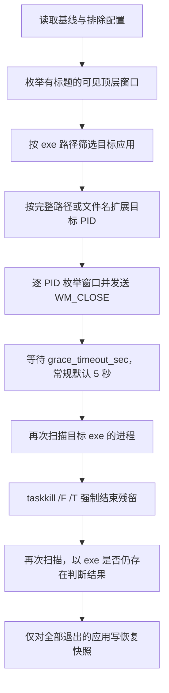

# GameSwitcher 全面审查与使用稳定性评估

审查日期：2026-10-05。源码基准：`2be74cb`。审查前 Git 工作区干净。

> 本文保留修复前的审查证据。后续已实施稳定性修复；当前行为、验证结果与剩余边界见 [修复说明](./FIXES.md)。

## 结论

当前实现适合在“所有内容已保存、允许应用被强制结束、只需要重新打开部分软件”的受控场景试用。尚不适合按 README 的“零弹窗、自动保存、断电级快照、完整恢复工作现场”承诺用于日常办公环境。

最严重的问题并非工具本身是否容易崩溃，而是**它可能关闭不应关闭的程序，并在关闭后失去恢复记录**。主要有六条路径：默认强杀未保存的应用、同名程序匹配越过保护边界、进程树关闭波及受保护子进程、快照写入晚于关闭、部分关闭的应用没有记录、恢复未确认即删除记录。

本次只增加本报告及两个验证脚本，没有修改应用逻辑，没有运行真实关闭、恢复、自启、退出操作，也没有修改用户实际配置或注册表。

## 范围、方法与限制

- 完整阅读 `core.py`、`main.py`、`storage.py`、`GameSwitcher.spec`、依赖文件和中英文 README；检查 Git 历史、构建警告以及当前安装的 pystray 后端实现。
- `python review/verify_stability.py`：22 项隔离检查全部通过。其中 20 项复现当前缺陷或行为边界，2 项确认已有容错保护。**通过表示观察符合预期，不表示软件已满足稳定性要求。** 所有进程、窗口、启动 API 使用模拟对象，存储使用临时 APPDATA。
- `python review/read_only_smoke.py`：使用真实依赖进行导入、只读进程/窗口枚举、图标 ICO 序列化、菜单生成检查；未创建运行中的托盘实例。右键后端检查替换了所有原生调用。
- Python 3.13.2 / Windows；pystray 0.19.5、Pillow 11.3.0、psutil 7.2.2、pywin32 312、PyInstaller 6.22.3。
- 三次只读枚举均识别 11 个应用，耗时约 38.91 / 4.28 / 3.29 ms。两个图标均能序列化为 ICO。这里只说明本环境的扫描与图标路径可运行，不构成长期稳定性、实际切换耗时或内存占用测试。
- 未验证发布版 EXE 与当前源码的一致性，也未重建/启动 EXE。未对真实 Office、浏览器、IDE、管理员应用执行破坏性验证；其具体会话恢复行为仍需专用测试环境验证。
- P1 表示应优先修复、可能误杀或丢失数据/恢复能力；P2 表示显著影响可靠性和使用体验；P3 表示维护、文档或较低风险问题。本报告不使用 P0，因为最高风险均有具体触发条件。

## 功能结构与实际行为

| 模块 | 职责 | 关键边界 |
| --- | --- | --- |
| `main.py` | 托盘、基线、排除、自启、操作线程 | 核心操作互斥；退出与部分菜单操作不受同一锁保护 |
| `core.py` | 枚举窗口、查询进程、关闭、启动 | 以可执行文件聚合；强制结束残留进程；启动后不确认就绪 |
| `storage.py` | JSON 持久化 | 单文件原子替换；没有事务日志、备份和数据结构校验 |
| `GameSwitcher.spec` | 单文件无控制台打包 | 大量依赖裁剪；没有对应的发布版自动验证 |

实际进入流程：

所谓“挂起”实际是结束进程，所谓“快照”实际是保存 exe、cmdline、cwd、PID、窗口句柄和标题。没有保存进程内存、未保存文档内容、浏览器会话文件或应用级工作区。重启后的恢复质量取决于目标应用自身能力。

## 风险总表

| 编号 | 等级 | 问题 | 主要后果 | 证据 |
| --- | --- | --- | --- | --- |
| F01 | P1 | 超时后一律强杀，没有保存/取消保护 | 未保存内容或应用状态丢失 | 源码、检查 03、09、22；官方 WM_CLOSE 说明 |
| F02 | P1 | 按 exe 文件名兜底匹配不同目录进程 | 越过基线/完整路径排除，或误判已经恢复 | 检查 01、02、11 |
| F03 | P1 | `/T` 子进程不重新校验保护规则 | 排除程序、后台任务甚至自身被连带结束 | 检查 03；官方 taskkill 说明；实际子树后果未实机执行 |
| F04 | P1 | 关闭完成后才保存快照 | 崩溃、退出或写失败导致无法恢复 | 检查 04 |
| F05 | P1 | 部分关闭应用归为 failed，不写快照 | 窗口已关但后台仍存活，恢复入口缺失 | 检查 05；部分进程关闭场景由源码推导 |
| F06 | P1 | 损坏/不可读配置静默当成空配置 | 保护规则消失，待恢复记录被隐藏/覆盖 | 检查 06、07；读取分支源码 |
| F07 | P1 | 启动成功与已经运行的判断过早 | 程序未实际恢复却删除记录 | 检查 11、12；官方 startfile 说明 |
| F08 | P1 | 退出不等待操作，工作线程为 daemon | 关闭中途停止，记录/状态未提交 | 源码审查，未真实中断进程 |
| F09 | P2 | 不校验 JSON 数据结构、字段与超时范围 | 启动/菜单异常、半执行、无限等待 | 检查 08、09、16、22 |
| F10 | P2 | 多实例聚合与启动参数回退丢上下文 | 多文档、多工作区、多配置无法完整恢复 | 检查 13、14 |
| F11 | P2 | 每次重新识别 PID、没有固定进程身份 | 新启动应用也可能被强杀，PID 重用保护不完整 | 检查 21；身份采样逻辑源码 |
| F12 | P2 | 清空失败静默、模式只依赖 pending 非空 | 状态与通知不一致、恢复记录反复出现 | 检查 17、18 |
| F13 | P2 | 动态排除菜单不在右键时刷新 | 新应用找不到或列表过时 | 真实后端只读检查、pystray 0.19.5 源码 |
| F14 | P2 | 菜单扫描/写盘仍在 UI 线程，跨线程菜单更新 | 卡顿及原生菜单竞争风险 | 真实依赖行为与源码；竞争后果待压力测试 |
| F15 | P2 | 扫描异常与 taskkill 失败信息被吞掉 | 静默漏扫、误判及排障困难 | 源码、检查 15 |
| F16 | P2 | 枚举仅覆盖有标题可见窗口，缺少用户/会话边界 | 托盘后台不被清理；扩大 PID 集时可能跨边界 | 源码审查 |
| F17 | P2 | 没有发布验证和可重复依赖约束 | 换环境或升级依赖后行为不确定 | 依赖文件、spec、Git 文件清单 |
| F18 | P3 | 宣传、配置项与实现不一致 | 用户对安全性、耗时和恢复范围产生误判 | 文档、检查 10、源码检索 |
| F19 | P3 | 日志粒度不足且无轮转，快照含明文上下文 | 故障证据不足、长期积累及本地隐私风险 | 源码审查 |

## 逐项分析

### F01 — 自动强杀绕过保存与取消意图

位置：[core.py:253](https://github.com/jokerD888/GameSwitcher/blob/2be74cb/core.py#L253)、[core.py:272](https://github.com/jokerD888/GameSwitcher/blob/2be74cb/core.py#L272)、[storage.py:72](https://github.com/jokerD888/GameSwitcher/blob/2be74cb/storage.py#L72)。

工具发送 `WM_CLOSE` 后等待超时，随后无条件执行 `taskkill /F /T`。没有检测保存对话框，没有等待用户确认，没有尊重“取消关闭”的结果，也没有提供默认安全模式。`skipped` 结果字段从未写入，`auto_save_enabled` 配置也未被关闭流程读取。

例：有未保存修改的编辑器收到关闭消息后显示保存提示；用户没有及时处理，或选择取消；工具仍可在超时后结束进程。增加超时只能增加处理时间，不能保证保存完成。大文件保存、网络盘和繁忙应用尤其容易超时。

`WM_CLOSE` 是关闭请求，应用可以弹出确认，也可以拒绝关闭。它不是通用自动保存协议。因此“完全零弹窗”和“发送优雅保存信号”都不能由当前实现保证。[Microsoft WM_CLOSE 文档](https://learn.microsoft.com/en-us/windows/win32/winmsg/wm-close)

建议：默认只请求正常关闭；仍存活的应用应保留并报告。强制结束作为明确可选策略，且应让用户知道未保存内容风险。若支持应用专用保存协议，分别实现和验证，不能用一个全局开关代替。

### F02 — 文件名匹配破坏路径级保护

位置：[core.py:139](https://github.com/jokerD888/GameSwitcher/blob/2be74cb/core.py#L139)、[core.py:156](https://github.com/jokerD888/GameSwitcher/blob/2be74cb/core.py#L156)、[main.py:174](https://github.com/jokerD888/GameSwitcher/blob/2be74cb/main.py#L174)、[core.py:358](https://github.com/jokerD888/GameSwitcher/blob/2be74cb/core.py#L358)。

入口按完整路径判定基线和排除，但 `pids_by_exes()` 同时建立 basename 索引。查询 `C:\Apps\editor.exe` 会把 `D:\Protected\editor.exe` 的 PID 一并返回，即使后者在基线或完整路径排除中。

这不是路径大小写问题，而是确定的跨目录匹配。多个目标 exe 同名时，basename 索引还会被后写入的目标覆盖。恢复也复用该函数：只有另一目录的同名程序在运行，当前待恢复项就可能被判定已经运行并删除。

建议：目标进程只按规范化完整路径匹配。文件名排除可以保留为用户明确选择的宽范围规则，但不能自动把完整路径查询扩大成文件名查询。检查 01、02、11 已隔离复现。

### F03 — 强制结束子树绕过所有应用保护

位置：[core.py:184](https://github.com/jokerD888/GameSwitcher/blob/2be74cb/core.py#L184)。

`_batch_taskkill()` 仅过滤传入列表中的 0、4 和自身 PID，随后使用 `/T`。它没有检查目标子孙进程是否属于基线、排除名单、系统保护集合或 GameSwitcher 自身。

例：被关闭的终端或 IDE 启动了排除名单中的程序、构建任务或游戏；强制结束父进程树时仍可能连带终止它们。若通过某个被选中的终端运行源码，排除自身 PID 也不能阻止自身作为该终端后代被 `/T` 波及。具体树形影响取决于实际父子关系，本次没有真实杀进程验证。[Microsoft taskkill 文档](https://learn.microsoft.com/en-us/windows-server/administration/windows-commands/taskkill)

建议：取消无条件 `/T`；如果需要清理辅助进程，应先显式枚举、校验每个子进程身份与保护规则，并排除自身及自身祖先。对于任意用户子任务，不能只凭父子关系判断其可安全结束。

### F04 — 快照提交顺序无法保障关闭期间的崩溃恢复

位置：[main.py:188](https://github.com/jokerD888/GameSwitcher/blob/2be74cb/main.py#L188)、[storage.py:96](https://github.com/jokerD888/GameSwitcher/blob/2be74cb/storage.py#L96)。

当前顺序是 `close_apps()` 返回后，才 `merge_pending_restore()`。在发送第一条关闭消息前，没有写任何本次恢复记录。进程关闭后到快照提交前，退出、崩溃、断电、磁盘满、目录权限变化，都可能让应用已关闭而恢复列表为空或缺少本次项。

`storage._save()` 的原子替换保护了已经存在的文件，但无法弥补“尚未开始写”的这段窗口。检查 04 模拟关闭成功后磁盘写失败，确认没有恢复记录。

建议：先持久化操作意图和所有目标记录，写失败就停止关闭；再执行关闭；逐项记录结果。下次启动根据日志和真实进程状态协调恢复。所谓“断电级安全”需要覆盖操作全过程，而不仅是 JSON 写入方法。

### F05 — 部分退出时，已经关闭的窗口没有恢复记录

位置：[core.py:277](https://github.com/jokerD888/GameSwitcher/blob/2be74cb/core.py#L277)、[main.py:189](https://github.com/jokerD888/GameSwitcher/blob/2be74cb/main.py#L189)。

只要某 exe 还有任何匹配进程，整个应用都被标记 `failed`。入口只保存 `closed`，不保存 `failed`。

例：同一 exe 的多个窗口进程中，一部分成功关闭，另一个进程由于权限、后台驻留或退出延迟仍存在；整个应用被标记失败，已经关闭的文档/窗口却没有待恢复条目。浏览器主窗口退出但辅助进程还活着也可能触发此路径。

建议：关闭前保存所有目标；区分窗口、应用实例、主进程和辅助进程；部分关闭不应直接丢弃恢复信息。检查 05 验证入口确实忽略 failed 项，具体应用的部分关闭形态需实机复测。

### F06 — 配置损坏时退化为扩大关闭范围

位置：[storage.py:32](https://github.com/jokerD888/GameSwitcher/blob/2be74cb/storage.py#L32)、[main.py:170](https://github.com/jokerD888/GameSwitcher/blob/2be74cb/main.py#L170)。

`_load()` 把缺文件、读取失败、编码错误、非法 JSON 都转换为调用方默认值，且没有记录原因。损坏基线返回 `[]`，损坏配置恢复成空排除；下一次进入模式就会关闭原本受保护的软件。损坏待恢复文件返回空列表，托盘恢复入口被隐藏；后续新快照写入还可能覆盖旧损坏文件。

首次启动没有基线也与“明确捕获了 0 个应用”的有效空基线无法区分，因此尚未执行配置流程就能直接开始关闭所有识别到的非排除应用。

建议：区分 missing / valid-empty / invalid / inaccessible；保护配置不可读时停止关闭并提供修复信息。损坏文件保留隔离副本；待恢复记录异常不能等同于“无需恢复”。检查 06、07 已复现非法 JSON 路径。

### F07 — 恢复成功判定不足，记录被提前删除

位置：[core.py:312](https://github.com/jokerD888/GameSwitcher/blob/2be74cb/core.py#L312)、[core.py:323](https://github.com/jokerD888/GameSwitcher/blob/2be74cb/core.py#L323)、[core.py:358](https://github.com/jokerD888/GameSwitcher/blob/2be74cb/core.py#L358)。

存在任意匹配 PID 就被判定 `already_running`，没有校验窗口是否回来、是否只是辅助进程、是否属于同一个应用实例。`launch_app()` 在 `Popen()` 或 `os.startfile()` 未抛异常时立即返回成功，随后删除待恢复项。初始化崩溃、单实例转交失败或参数处理失败可能发生在返回之后。

Python 文档明确说明 `startfile()` 无法等待应用退出或获取退出状态；当前代码也没有补充启动就绪验证。[Python os.startfile 文档](https://docs.python.org/3.13/library/os.html#os.startfile)

建议：区分 launch-requested / process-started / ready / restored；设置有限确认窗口，按应用类型确认主进程或窗口。无法确认的记录保留并允许重试；无界面程序需要不同的就绪策略，不能强制一律等窗口。

检查 11 复现不同目录同名后台进程导致跳过恢复；检查 12 模拟新进程立即以失败退出，工具仍清空记录且从未读取 `poll()`。

### F08 — 退出流程与后台操作不协调

位置：[main.py:69](https://github.com/jokerD888/GameSwitcher/blob/2be74cb/main.py#L69)、[main.py:358](https://github.com/jokerD888/GameSwitcher/blob/2be74cb/main.py#L358)。

动作线程全部是 daemon；`_exit_app()` 不检查 `_action_lock`，不等待进行中的关闭/恢复，也没有取消点和持久化收尾。托盘停止、主线程退出后，daemon 线程可以在任何阶段被中断。互斥句柄还先于实际完成退出被关闭，理论上允许另一个实例在旧 worker 仍运行时进入。

建议：建立退出状态；拒绝新操作；等待或安全取消正在运行的任务，并先提交状态；最后释放单实例互斥和停止托盘。用户点击退出无需再次询问权限，但产品必须完成必要收尾。

### F09 — 无数据校验导致启动失败、半执行或无界等待

位置：[storage.py:68](https://github.com/jokerD888/GameSwitcher/blob/2be74cb/storage.py#L68)、[core.py:253](https://github.com/jokerD888/GameSwitcher/blob/2be74cb/core.py#L253)、[main.py:443](https://github.com/jokerD888/GameSwitcher/blob/2be74cb/main.py#L443)。

有效 JSON 并不保证类型正确。`config.json` 为 `null`、列表或数字时 `setdefault()` 抛异常；`pending_restore.json` 为 `null` 时启动的 `len()` 抛异常。应用项缺少 exe、exclude_list 为非字符串列表、cmdline 含错误类型等也未验证。

更严重的是超时转换发生在发送 `WM_CLOSE` 之后。`grace_timeout_sec="bad"` 会让应用已收到关闭请求，然后操作抛异常且没有记录。正无穷会令仍存活进程的等待没有有限上界；负数/NaN 会跳过缓冲。使用 `time.time()` 还容易受系统时间调整影响。

建议：加载时对所有文件校验类型、必填字段、路径和字段范围；超时必须有限且有合理上下限；破坏性操作之前完成全部校验；等待使用 `time.monotonic()` 和同一绝对截止时间。检查 08、09、16、22 已验证相关入口。

### F10 — 多实例和启动上下文恢复不完整

位置：[core.py:81](https://github.com/jokerD888/GameSwitcher/blob/2be74cb/core.py#L81)、[core.py:95](https://github.com/jokerD888/GameSwitcher/blob/2be74cb/core.py#L95)、[core.py:309](https://github.com/jokerD888/GameSwitcher/blob/2be74cb/core.py#L309)、[storage.py:99](https://github.com/jokerD888/GameSwitcher/blob/2be74cb/storage.py#L99)。

`visible_apps()` 按 exe 合并，保留第一个 PID 的 cmdline/cwd，后续实例只增加窗口句柄和标题。三个同 exe 文档进程关闭后，恢复最多执行一次保存的启动命令。pending 合并也按 exe 覆盖，无法保留多次挂起的不同实例上下文。

带参数 `Popen` 失败后，回退到 `os.startfile(exe)`，不传文档参数和 cwd；最后保底启动同样不带参数。即使程序出现了，也可能没有打开原文档、工作区、配置目录或浏览器 profile。检测到内部 `--type=` 等参数时会丢弃整组参数，属于保守回退，但不能保证外部启动上下文完整。

建议：定义“恢复到什么程度”的产品契约；区分应用实例并保留各自上下文；建立浏览器、IDE 等应用适配器；参数回退应标记降级恢复，不能直接报告完整成功。检查 13、14 已复现。

### F11 — 目标集合会变化，PID 重用防护覆盖不完整

位置：[core.py:200](https://github.com/jokerD888/GameSwitcher/blob/2be74cb/core.py#L200)、[core.py:267](https://github.com/jokerD888/GameSwitcher/blob/2be74cb/core.py#L267)、[core.py:192](https://github.com/jokerD888/GameSwitcher/blob/2be74cb/core.py#L192)。

关闭前、强杀前、结果确认时分别重新扫描 exe。等待期间用户重新打开同软件，或守护程序重启它，新 PID 会直接进入强杀集合。检查 21 模拟目标从 1001 变为 1002，确认强杀的是从未收到本轮正常关闭请求的 1002。

`_wait_exit()` 虽然比较创建时间，但 birth 是每次调用时新采样的；没有保存最初选中进程的创建时间，也没有在提交 taskkill 前再次核对原身份。因此它只防护某次短等待内部的 PID 重用，不能覆盖整个操作。

建议：操作开始时固定目标身份 `(pid, create_time, exe, session)`；每次关闭/结束前核对同一身份。显式区分“关闭本轮实例”和“阻止应用重启”，不要暗中扩大操作范围。

### F12 — 状态与存储提交结果不一致

位置：[storage.py:108](https://github.com/jokerD888/GameSwitcher/blob/2be74cb/storage.py#L108)、[main.py:240](https://github.com/jokerD888/GameSwitcher/blob/2be74cb/main.py#L240)、[main.py:375](https://github.com/jokerD888/GameSwitcher/blob/2be74cb/main.py#L375)、[main.py:183](https://github.com/jokerD888/GameSwitcher/blob/2be74cb/main.py#L183)。

清空失败的任意 `OSError` 都被吞掉。放弃恢复仍通知已清空；恢复全部成功时也可能保留旧文件，重启后旧条目再次出现。检查 17 已复现删除被拒时没有错误且文件仍在。

模式完全由 pending 是否非空推导。无目标时通知“已在游戏模式”，但 pending 为空，托盘实际显示普通模式；部分关闭失败也可能没有红色状态。pending 记录数量并不代表仍在被挂起的应用数量。

建议：删除缺文件可视为幂等成功，其他错误应报告；操作状态与恢复清单分开建模，至少区分 ready / entering / game / restoring / partial-failure。只有存储提交成功后才能发送成功提示。检查 18 已复现空目标通知矛盾。

### F13 — 排除菜单的当前应用列表并非实时

位置：[main.py:285](https://github.com/jokerD888/GameSwitcher/blob/2be74cb/main.py#L285)、[main.py:308](https://github.com/jokerD888/GameSwitcher/blob/2be74cb/main.py#L308)、[main.py:391](https://github.com/jokerD888/GameSwitcher/blob/2be74cb/main.py#L391)。

使用动态 submenu 并不等于每次右键都重建原生菜单。当前安装的 pystray 0.19.5 Win32 后端右键分支直接使用现有菜单句柄，菜单一般在初始化、动作回调后或显式更新时重建。本工具没有监测应用变化或右键前刷新，因此新打开的软件可能不在首次右键列表中。

只读脚本确认原生右键分支调用 `update_menu()` 的次数为 0。列表还只展示排序后的前 15 项，没有“更多”入口；候选项只检查 basename 排除，对完整路径排除的显示也可能重复。

建议：增加“刷新运行应用”入口或按需后台刷新缓存；超过 15 项提供分页/更多；展示路径以区分同名软件，并让显示规则与实际排除规则一致。

### F14 — UI 阻塞与跨线程更新仍存在

位置：[main.py:261](https://github.com/jokerD888/GameSwitcher/blob/2be74cb/main.py#L261)、[main.py:297](https://github.com/jokerD888/GameSwitcher/blob/2be74cb/main.py#L297)、[main.py:420](https://github.com/jokerD888/GameSwitcher/blob/2be74cb/main.py#L420)。

主要关闭/恢复动作已移至 worker，这是正确方向。但 `_add_exclude()`、`_toggle_exclude()` 仍同步读写文件并扫描进程；更关键的是 pystray 的动作包装器在回调返回后立即在原回调线程调用 `update_menu()`，重新生成动态 submenu。即使动作本身用了 `@threaded`，这段菜单扫描也仍在消息线程上。

当前环境扫描较快，不代表权限复杂、进程数量多、磁盘慢或安全软件拦截时不会卡顿。worker 同时直接修改 `icon.menu`；pystray 后端重建时会 `DestroyMenu`，因此与 UI 正在展示/重建菜单存在竞争窗口。此处认定为缺少串行化的风险，未声称已复现原生崩溃。

建议：后台扫描后发布只读缓存；菜单生成只读内存；将图标/标题/菜单变更统一派发到 UI 线程；配置修改和状态提交串行化。忙碌时禁用冲突动作，避免连续点击创建大量 worker 和警告弹窗。

### F15 — 错误吞掉后无法可靠判断和定位失败

位置：[core.py:110](https://github.com/jokerD888/GameSwitcher/blob/2be74cb/core.py#L110)、[core.py:178](https://github.com/jokerD888/GameSwitcher/blob/2be74cb/core.py#L178)、[core.py:195](https://github.com/jokerD888/GameSwitcher/blob/2be74cb/core.py#L195)、[core.py:205](https://github.com/jokerD888/GameSwitcher/blob/2be74cb/core.py#L205)。

窗口枚举最外层 `except Exception: pass` 可以把途中错误变为部分结果；捕获基线时可能把部分结果当成完整基线覆盖旧文件。进程/窗口访问被拒时通常静默略过。`_wait_exit()` 第一次读取身份遇到 AccessDenied 直接返回 True，将“无法判断”当成“已退出”，可能提前进入强杀阶段。

taskkill 的返回码、stdout/stderr 完全忽略；超时和 OSError 也被吞掉。后续只有统一“权限或假死”提示，不能区分权限、命令启动失败、超时、重启或扫描故障。检查 15 复现 AccessDenied 的退出误判。

建议：区分 exited / alive / unknown；保留每个阶段错误及 taskkill 结果；枚举未完整完成时停止基线覆盖和关闭操作。单个窗口销毁属于正常竞争，可以局部略过，但不能把任意扫描异常都当正常空结果。

### F16 — 处理范围与使用者理解不同

位置：[core.py:64](https://github.com/jokerD888/GameSwitcher/blob/2be74cb/core.py#L64)、[core.py:146](https://github.com/jokerD888/GameSwitcher/blob/2be74cb/core.py#L146)、[core.py:36](https://github.com/jokerD888/GameSwitcher/blob/2be74cb/core.py#L36)。

初始目标必须有可见顶层窗口和非空标题，关闭到托盘的聊天软件、无窗口后台工具、部分商店应用代理窗口不会被完整识别。因此“清空所有非基线后台”超过了实现范围。

反过来，一旦某 exe 被选中，PID 收集就扩展到所有可读同路径/同名进程，没有限制当前用户、当前会话或初始窗口实例。常规非管理员运行时权限会限制部分访问；管理员运行则可能扩大影响，不能将访问权限当成产品边界。

建议：明确展示实际目标；默认约束当前用户和会话；为托盘应用提供显式受支持规则。界面应称“关闭识别到的应用”，直到后台范围有可验证的实现。

### F17 — 发布与环境变化缺少验证闭环

位置：[requirements.txt:1](https://github.com/jokerD888/GameSwitcher/blob/2be74cb/requirements.txt#L1)、[GameSwitcher.spec:4](https://github.com/jokerD888/GameSwitcher/blob/2be74cb/GameSwitcher.spec#L4)。

原仓库没有自动测试、CI 或发布冒烟脚本。依赖只有下界，没有经验证版本组合；PyInstaller 不在构建依赖中，干净环境按 README 安装 requirements 后不一定能执行构建命令。

spec 大量排除标准库/Pillow 插件，并按二进制名称关键词再过滤。裁剪不必然导致错误；当前源码图标路径也已通过检查。但依赖升级可能新增间接依赖，现有 `warn-GameSwitcher.txt` 不能自动判定缺失项是否影响实际功能。本报告不将可选平台模块的警告直接认定为缺陷。

建议：记录并锁定一个验证过的运行/构建环境，区分 runtime 与 build 依赖；在干净 Windows 环境构建后验证 EXE 启动、托盘、图标、重启、配置和安全模拟流程。发布时记录版本、源码提交与制品哈希，确保用户问题能对应源码。

### F18 — 速度、安全与恢复承诺需要校正

- 文档和 `close_apps()` 注释说 1.5 秒，但常规 `load_config()` 默认是 5 秒。仅调用 `close_apps()` 且未提供此配置时才使用其内部 1.5 秒默认。检查 10 已确认。
- “并发广播”实际是 Python 循环逐 PID `EnumWindows`；`PostMessage` 异步并不等于窗口枚举并行。关闭阶段还要扫描三次全系统进程，按每个目标 PID 遍历窗口，近似增加 `PID 数 × 窗口数` 开销。
- 等待内每个 `_wait_exit(p, 0.05)` 使用 0.1 秒 sleep，多个进程可令外层截止时间被超出；taskkill 又最多等待 10 秒，随后固定 0.15 秒确认。因此“体感 1 秒”“1–2 秒完成”不能作为上界。
- `auto_save_enabled` 只有默认定义，无读取执行；requirements 关于 pywinauto 和“人工确认回落”的注释对应功能没有实现。
- 会话恢复依赖目标应用设置；没有应用适配器或自有会话备份，不能保证浏览器所有标签、IDE 工作区及未保存内容恢复。
- 常驻内存约 6.7 MB、CPU 0% 未由本次验证。不能把短时扫描耗时或源码 smoke 进程资源当成发布 EXE 常驻指标。

建议：统一默认值和描述；给出明确的恢复范围与失败状态；性能承诺基于发布制品和多场景实测，使用分位数与测试环境说明。

### F19 — 日志与快照的维护边界

位置：[main.py:23](https://github.com/jokerD888/GameSwitcher/blob/2be74cb/main.py#L23)、[main.py:58](https://github.com/jokerD888/GameSwitcher/blob/2be74cb/main.py#L58)、[core.py:95](https://github.com/jokerD888/GameSwitcher/blob/2be74cb/core.py#L95)。

日志主要记录动作开始/结束和顶层异常，缺少操作 ID、目标数量、关闭/强杀/恢复各阶段结果、耗时和底层错误；没有轮转。用户报告误杀后难以追查实际 PID 和路径。

JSON 明文保存完整命令行、工作目录、窗口标题，baseline 也保留了用于恢复之外的信息。命令行可能包含敏感路径或参数；正常本地文件存储不等于漏洞，但诊断分享时应避免无提示发送全部配置。当前代码没有网络上报。

建议：日志轮转和结构化事件；默认记录可排障的最小信息，对敏感参数做脱敏；baseline 只存必要的身份规则，失效 HWND/PID 不作为重启后的状态依据。

## 已有优点及其适用边界

1. **文件原子写入较完善。** 同目录临时文件、flush/fsync、`os.replace` 重试和清理能避免大多数半写 JSON。检查 19 确认替换失败时旧快照保持完整。fsync 错误被忽略且没有备份，不应宣传绝对断电保证。
2. **主要动作互斥。** 捕获、进入、恢复、放弃使用同一非阻塞锁，且 finally 释放，能避免正常菜单操作重叠。退出和配置修改仍需纳入生命周期设计。
3. **失败恢复项保留。** 文件不存在或启动明确失败时仍保留 pending，检查 20 已确认。需要补足“请求接受后失败”的状态。
4. **程序定位使用绝对 exe 路径，Popen 使用参数列表。** 减少了常见的空格拆分和 shell 引号问题；basename 查询兜底仍需移除。
5. **系统名单、自身 PID 与单实例互斥提供基本保护。** 但保护没有贯穿进程树、会话和持久化；`Local` 互斥只覆盖相同登录会话，而同一用户不同会话仍可能共享 APPDATA 文件。
6. **没有主动网络功能。** 本地运行和本地持久化路径简洁，复杂度较低。复杂性主要来自跨应用关闭/恢复行为，本身不能只靠缩小代码量解决。

## 修复顺序与验收条件

### 第一阶段：先确保不会误杀、不会先丢记录

顺序：F02 → F03 → F04/F05 → F01 → F06/F09 → F08。

- 只按完整路径匹配；选中 C 目录程序时，D 目录同名程序必须不在关闭集合。
- 基线、排除、自身和当前会话规则在所有结束路径持续有效，进程树不能绕过。
- 在第一次关闭请求前提交记录；提交失败时不能发出任何关闭消息。
- 默认不强制结束等待保存/取消的程序；给出可理解的未关闭结果。
- 损坏/不可读保护配置时停止关闭；对显式空基线和首次未配置作不同处理。
- 退出过程中保持操作可恢复，并等待安全收尾。

### 第二阶段：让恢复结果可核实

顺序：F07 → F10/F11 → F12 → F15。

- 新 PID、同名其他路径和辅助进程都不能被当成同一个已恢复实例。
- 启动请求返回后崩溃的程序保留恢复记录；参数回退明确标记为降级。
- 支持多个独立文档/实例，或在产品界面明确只恢复一个程序入口。
- 删除/写盘失败时提示准确，不能宣称已清空或已完成。
- 日志可以回答“选择了谁、正常关闭了谁、强杀了谁、为何恢复失败”。

### 第三阶段：改善使用和发布可靠性

顺序：F13/F14/F16 → F17 → F18/F19。

- 排除菜单能通过刷新获得新软件，超过 15 项仍可选择；UI 不执行进程扫描和慢文件写入。
- 图标/菜单更新串行化；反复快速点击和开关菜单不会出现原生句柄竞争。
- 构建环境固定，发布 EXE 有独立安全冒烟和重启验证；README 与测试过的能力一致。

## 后续实机测试矩阵

以下场景应在独立 Windows 测试账户或虚拟机中执行。不要用重要工作内容验证强杀行为。

| 场景 | 验收重点 |
| --- | --- |
| 未保存编辑器、Office 大文档、用户取消关闭 | 默认保留应用；未保存内容不被强杀 |
| 正常保存、慢保存、网络盘保存、应用无响应 | 有界等待；结果与实际关闭状态一致 |
| 浏览器多窗口/多 profile、IDE 多工作区 | 记录和恢复契约明确，不能误报完整恢复 |
| 同名不同目录程序、完整路径排除 | 不误关、不误判已运行 |
| 终端/IDE 启动排除程序和后台子任务 | 子树保护有效，自身存活 |
| 管理员应用、不同用户/会话 | 只处理授权范围，权限错误可诊断 |
| 关闭过程中重开程序、PID 重用、应用自动重启 | 固定身份；新实例不被本轮误杀 |
| 关闭各阶段退出/崩溃，恢复各阶段退出/崩溃 | 重启后有足够记录协调恢复 |
| 磁盘满、权限拒绝、文件占用、非法 JSON、错误类型 | 操作前校验；失败不扩大关闭范围 |
| 快速重复点击、worker 完成时菜单仍打开 | 无死锁、句柄竞争、无限线程/弹窗 |
| 启动后新开软件、运行软件超过 15 个 | 排除列表可刷新，完整可达 |
| Explorer 重启、锁屏/解锁、休眠、DPI/显示器切换 | 图标可见、状态一致，配置不损坏 |
| 安全模拟连续切换 100 轮 | 记录不丢失、失败可重试、资源不持续增长 |
| 干净系统发布 EXE、自启路径含空格、EXE 移动 | 自启状态可验证，启动异常有可见诊断 |

## 验证脚本

- [隔离行为审查脚本](./verify_stability.py)：原审查脚本已改为安全回归测试入口；检查期望的安全行为，无需安装第三方运行依赖。最初 22 项审查结果保留为历史证据。
- [真实依赖只读冒烟脚本](./read_only_smoke.py)：需要当前 Windows 运行依赖，用于检查导入、枚举、图标和菜单后端行为。当前包含 pystray 0.19.5 私有后端探针，不应直接作为跨版本公共 API 测试。

原始业务源码未改动。本报告所列的 P1 风险仍然存在。
